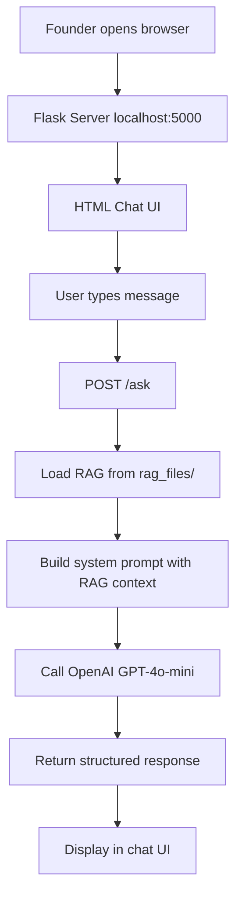

# Founder Intake App — Homework Submission

## I Built This on a Raspberry Pi with a Custom AI Assistant

I decided to take a slightly different path for this assignment. Instead of working directly in an IDE on my laptop, I spent the weekend building a **Raspberry Pi** (think of it as a credit-card-sized, DIY computer). I then turned this Raspberry Pi into my own private AI workstation.

I’m running an interface called **Hermes** on the hardware, which manages my files and keeps my work private. For the "brain" of the system, I’ve connected it to a foundational LLM called **Kimi K2.6**. I then linked the whole system to a **Discord** chat room.

So now, instead of writing code in a standard editor, I’m chatting with my own custom-built assistant via Discord to generate the server and HTML required for the homework. **I wanted to test whether I could own the entire stack** — not just the Python code, but the environment it runs in, the AI that helps me write it, and the interface I use to collaborate. This felt closer to the spirit of "owning the source" than just installing an IDE.

The result: a fully working Founder Intake app with backend RAG, LLM integration, and a clean chat UI — all built, tested, and debugged through a Discord conversation with my assistant.

---

## What the App Does

This prototype replaces an expensive in-person founder workshop with an AI-driven intake conversation. Here’s the flow:

1. A startup founder opens the app and describes their target user in natural language
2. The AI (GPT-4o-mini) listens, reflects back what it heard, and flags gaps in the founder’s thinking
3. The AI is guided by a structured **RAG file** that defines 6 key topics every founder should cover: WHO, PAIN, CURRENT SOLUTION, TRIGGER, DECISION, and SUCCESS
4. The most valuable thing the AI does: **catch what the founder DIDN’T say**

---

## System Architecture



---

## Tech Stack

| Layer | Technology |
|---|---|
| Hardware | Raspberry Pi 5 (8GB RAM) |
| AI Interface | Hermes Agent |
| LLM (brain) | Kimi K2.6 (for coding assistance) |
| App LLM | OpenAI GPT-4o-mini |
| Backend | Python + Flask |
| Frontend | Vanilla HTML/CSS/JS |
| RAG Storage | Plain text files in `rag_files/` directory |
| Collaboration | Discord chat |

---

## RAG Design

The RAG file is the secret sauce. It doesn’t just feed facts to the LLM — it teaches the LLM **how to conduct the conversation**. It includes:

- The 6 topics the founder should cover
- Rules for reflecting back ("So what I’m hearing is…")
- Rules for flagging gaps (prioritize the biggest one first)
- Rules for catching contradictions gently
- Tone guidance (warm, direct, smart friend — not consultant)
- Two complete examples (good input + input with gaps)

The RAG lives server-side in `rag_files/`, so the user never sees it or uploads it. Clean separation of concerns.

---

## The Prompt Template

I structured the system prompt as a template that injects the full RAG context, then adds instructions on top:

1. Read the founder’s message carefully
2. Reflect back what you heard
3. Flag any gaps from the six topics
4. Flag contradictions gently
5. Keep tone warm and conversational
6. **Do NOT dump all gaps at once**
7. If input is vague, say "I don’t have enough to work with yet on [topic]"

---

## Screenshots

*(Screenshot: App running in browser showing welcome message, user input, and AI reflection with gap flagged)*

**Example conversation:**

> **Founder:** *"We are building an AI tool for recruiters. There are way too many applicants and not enough time to review them all."*
>
> **AI:** *"So what I’m hearing is: you’re creating an AI tool aimed at helping recruiters who are overwhelmed by the volume of applications they receive. Is that right? One thing I didn’t hear you mention is who exactly your target user is. Are you focusing on in-house recruiters at companies, or agency recruiters who work with multiple clients? Those are quite different in terms of their workflows. Is that something you’ve thought about, or is it still fuzzy?"*

The AI caught the gap exactly as the RAG instructed — and prioritized the most important one (specific WHO) instead of dumping a list.

---

## What I Learned

**The hard way:** My Anthropic free-tier key had zero credits, so I had to pivot to OpenAI mid-build. This actually taught me something useful — **always abstract your LLM client**. If I had hardcoded Claude everywhere, I would have had to rewrite half the app. Instead, it was a 5-minute swap.

**The unexpected win:** Debugging through Discord chat felt more natural than I expected. Instead of staring at a terminal, I was explaining errors to my assistant, who would suggest fixes, apply them, and re-run — all in the same conversational thread. It felt closer to pair programming than vibe-coding.

**The meta-lesson:** The professor wanted us to "own the source" instead of using Lovable or Replit. Building the *entire environment* myself — including the AI assistant that helped me write the code — took that idea one step further. I don’t just own the Python file. I own the box it runs on, the model that helps me write it, and the pipe that connects them.

---

## File Structure

```
founder-intake-app/
├── server.py                    # Flask + OpenAI + RAG loader
├── templates/
│   └── index.html         # Chat UI (Quicksand, #149911 buttons)
├── rag_files/
│   └── founder-intake-rag.txt   # RAG context (server-side)
├── requirements.txt             # flask, openai
└── README.md
```

---

## How to Run It

```bash
cd founder-intake-app
python3 -m venv venv
source venv/bin/activate
pip install -r requirements.txt
export OPENAI_API_KEY="sk-..."
python3 server.py
# Open http://127.0.0.1:5000
```

---

## Questions for the Class

1. **How are you handling API key security?** I’m using environment variables, but I’m curious if anyone has found a cleaner pattern for class projects.
2. **Did anyone else hit rate limits or credit issues?** Swapping from Anthropic to OpenAI was my solve, but I wonder if there’s a smarter fallback strategy.
3. **RAG vs. Fine-tuning:** For a structured conversation like this, RAG feels like the right tool. But has anyone experimented with few-shot prompting or fine-tuning for similar use cases? Would love to compare notes.

---

Looking forward to seeing everyone else’s builds!
